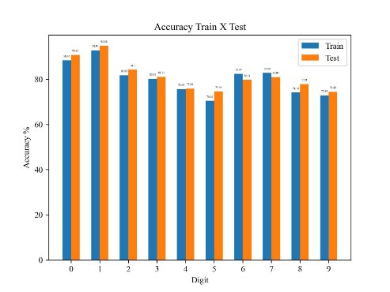
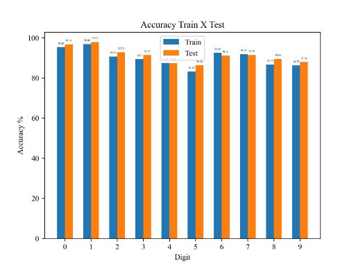
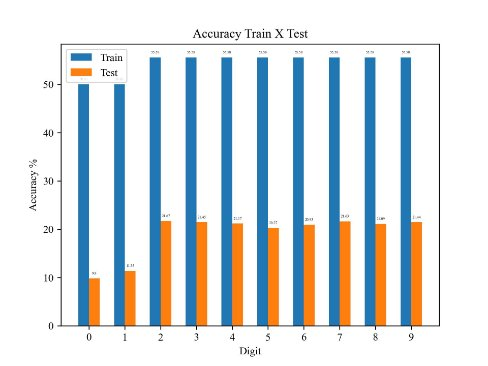
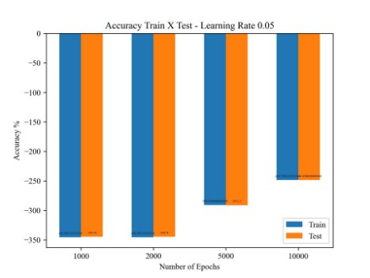
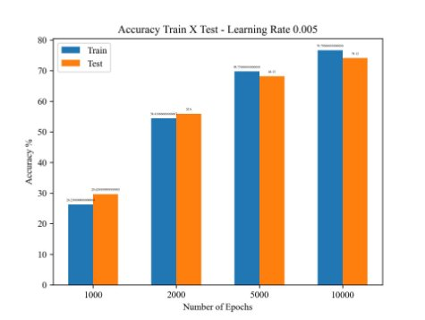
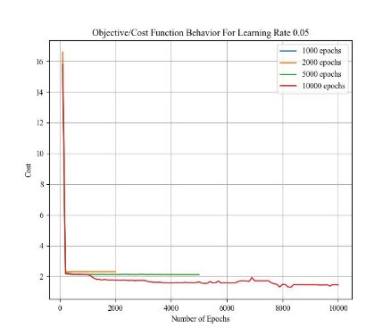
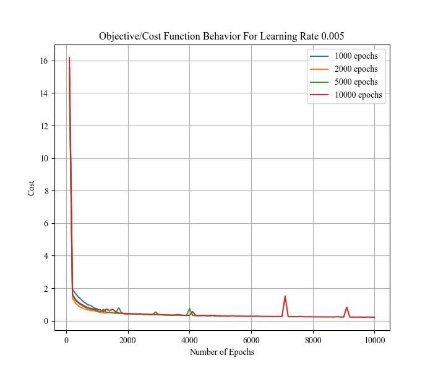

Mendes 11

Raniery Mendes Dr. Paul Pauca CSC 675

08 March 2024

Project #2

Neural Networks (NNs) are powerful methods for learning non-linear mappings in data. In this project, to better understand how NNs work and learn latent representations of the data I implement both a two-layer DL model and a single neuron to perform classification tasks on the MNIST dataset.

**Methodology (Part 1)**

In part I, I code a neural network framework to perform logistic regression, that is, I implement a single neuron using the NNs’ learning intuition/mindset to perform binary classification on the MNIST data. Since the model performs a binary classification, to be able to perform multi-class classification, we need to reformulate the problem scene. In other words, I decided to perform binary classification for each one of the 10 classes (digits) in the dataset. This results in training and evaluating 10 models such that each one of them is responsible for classifying a digit, i.e. we have a model that classifies whether a sample image is digit 0 or not, another one that does the same thing but for digit 1, and so on.

It is well known that the MNIST dataset contains a training set with 60,000 sample images and a test set with 10,000. However, as I build a model for each class, it is important to consider how to properly select the training set such that the model can learn how to identify the target digit. I opted to reduce the training size for each digit to almost 10,000 image samples because different from part 2, we are not interested in having a single model that classifies all 10-digit classes. 5,000 samples are from the target digit; the remaining 5,000 are selected randomly in equal portions from the other 9 classes. I argue that this setup is efficient and effective because My results show that the single neuron model, which implements logistic regression, can successfully learn the data representation and perform binary classification.

This single neuron model possesses 784 weights, which are associated with each input feature of a sample - this dimension is due to the flattening of the data. Following the NN mindset, after the linear transformation is performed by those weights (and the bias is added), we apply a sigmoid non-linear activation. The former ensures that the output value is within the interval [0,1]. Furthermore, to investigate the power of the model I trained and evaluated the set of 10 models (one for each class) with different learning rates. On the other hand, I maintained the number of epochs equal to 1000 across all runs to ensure we could see how the learning rate (𝞪) influences the model convergence. I remind the reader that this factor is responsible for dictating how large the model is stepping down the gradient. That is, it informs how much we update the weights and biases to descend along the gradient. Besides that, I test all digit models on the entire original test set provided by Keras, i.e. 10,000 samples. I perform some pre-processing such that it becomes a binary classification problem, that is, I make all target-digit sample labels equal to one, and all the other classes’ labels are set to zero. Lastly, given the output range of the sigmoid function, I decided to use 0.75 as the threshold for determining whether a sample belongs to the target-digit class or not.

**Results & Analysis (Part 1)**

Below I report the plots of accuracy performance for both training and testing of each digit-model. Each figure contains the accuracy of all 10 models obtained using the same hyperparameter configurations. I warn the reader that for this part of the assignment, I opted not to consider the objective/cost function in my analysis because it deals with an unrealistic deep-learning scenario in which we work with a single neuron. As part 2 of this project implements a two-layer NN for multiclass-classification, I believe that task provides better insight into how the learning rate influences the cost function, i.e. how it influences the model’s convergence rate.

Figure 1. Accuracy Performance of each single neuron digit-model. 1000 Epochs and learning rate 0.01.

As we can see in the plot above, the single neuron model is able to achieve an average of about 75% accuracy for both training and testing for all the 10 models, that is, it accomplishes the goal of performing logistic regression multiclassification with a NN mindset. Interestingly, the models for digits 0 and 1 are the ones that present the best performance. They achieve, respectively, 90.83% and 94.88% of accuracy during testing. On the other hand, the model for digit 5 is the one with the “worst” performance among all ten digits - however, those results are still satisfactory. This is quite compelling because I remember that in project 1, digit five was one of the hardest to be “clusterized” by my agglomerative cluster model. Moreover, Figure 2 shows how with a learning rate of 0.05 the single-neuron models are capable of achieving even higher accuracy. All digits’ test and training sets achieved accuracy above 80%. Indeed, we see that different from the setup reported in Figure 1, in this experiment, I was able to obtain 5 (digit) models with test accuracy above 90%. Thus, with this tiny increase in the learning rate, we can boost the accuracy a bit more.

Figure 2. Accuracy Performance of each single neuron digit-model. 1000 Epochs and learning rate 0.05.

On the other hand, reducing the 𝞪factor by about one order of magnitude, that is, I set the learning rate to 0.001 (1e-3). The plot exhibited in Figure 3 describes how maintaining all other hyperparameters the same but decreasing alpha the accuracy drops dramatically. From, my personal experience this might indicate the need for a very large number of epochs to be able to achieve decent accuracy levels. That is because the step size is so small that it will require way more iterations to descend the gradient and find a local minimum. However, such a small alpha can also cause the model to get stuck in an unwanted local minimum.

Figure 3. Accuracy Performance of each single neuron digit-model. 1000 Epochs and learning rate 0.001.

Looking at Figures 2 and 3, we observe how the learning rate plays a critical role in the convergence of the model. It dictates how much the weights and biases will be updated given the gradient information. While the experiment whose learning rate is equal to 0.05 has its best digit model achieving 97.91% accuracy in the test set, with alpha equal to 0.001 the best model achieves only 21.67%. This represents a drop in about 75% (absolute) accuracy. I note, however, that the best single neuron digit model across all those three different learning rates is digit one. **Methodology (Part 2)**

In this part I implemented a two-layer neural network to perform multitask classification on the MNIST dataset. I use a ReLu activation function for the hidden layer, followed by a softmax activation layer for the output layer. This combination of activation functions is widely used and proven to be successful in the literature. Further, I replaced the sigmoid function for the internal layer because we are no longer attempting to perform a binary classification. This also

leads to the reason behind the choice of the softmax function. I used that because it allows us to understand our output as a probability distribution - i.e. all values add to one. Therefore, as we are trying to classify a sample into one of the 10 classes, the softmax output gives us the probability that a sample belongs to each class.

Even though I performed multiple experiments with different hyperparameter settings such as different sizes of the hidden layer, different learning rates, and different numbers of epochs, I decided[^1] to report and analyze the results for the configuration portrayed in Table 1. This is because those hyperparameter settings are the ones that provide the most meaningful insights about the dataset and successfully perform multiclass classification on the MNIST dataset’s 10-digit classes. For example, the experiments set with a hidden layer equal to 100 nodes, even with different epoch values, achieved accuracy below 60% for both training and testing. I even considered increasing the hidden layer to 784 nodes, however, the (matrix) computations would significantly increase, demanding extreme hardware power. So, as ran this project locally on an M2 laptop, I chose to look for smaller values. I must acknowledge that I got some intuition from part 1, in which we had only a single neuron, thus, I thought we would not need an extremely large hidden layer to obtain satisfactory results.

|**Hidden Layer**|32|
| - | - |
|**Output Layer**|10|
|**Learning Rates**|0\.05 & 0.005|
|**Epochs**|1000, 2000, 5000, & 10000|

Table 1. Hyperparameters of the experiments reported in this paper.

Different from part I, for this multi-class classification task no prior pre-processing of the MNIST dataset was required. I rely on the original Keras split of the data, i.e. 60,000 samples for training and 10,000 samples for testing. However, the sample labels are one-hot-encoded during training and testing (prediction). This is essential because that is similar to the output coming from the model. It outputs the probability of the sample belonging to each one of the 10 classes. Thus, with the one-hot encoding of the label, we can compute the backpropagation without any problems, and ensure the model will learn the nonlinear mapping between the input and output data.

**Results & Analysis (Part 2)**

My experiments confirmed that the two-layer model with the configuration exhibited in Table 1 is capable of successfully executing the classification task of all 10 digits in the MNIST data. I point out that the results are very interesting because they show a different situation compared to the results of part 1 of this project. In the single-neuron case, we observed that higher learning rates performed way better than one with a smaller magnitude e.g. 0.001. In part 2 a learning rate with a smaller magnitude presented impressive accuracy results, whereas higher learning factors performed poorly.

As illustrated in the table above, my experiments looked at how the 𝞪values influenced the model’s performance across a set of four different epoch values. We see an extremely horrible performance for the learning factor equal to 0.05. The performance is so bad for both training and testing that all the accuracy metrics reported are negative. On the other hand, I point out that as we increase the epoch values the accuracy metrics increase, however, they remain below the x-axis by a lot. I suppose that, because we have two layers learning different representations of the data, 𝞪= 0.05 leads the model to perform large updates to the weights and biases. This ultimately may lead it to be jumping around a local or global minima all the time, but without being able to step down to the steepest area. In other words, it becomes hard to optimize the learning, especially because we are updating all the weights and biases, without any kind of mini-batch or SGD strategy.

Figure 4. 2-Layer NN performance on MNIST data with learning rate equal to 0.05

As I mentioned with the learning rate reduced to 0.005, my two-layer NN model gracefully learns how to classify the 10 classes of the MNIST dataset. The plot in Figure 5 is compelling once it also indicates how the model requires more epochs to improve its accuracy performance. With only 1000 epochs it accomplishes accuracy below 30%, which is not reasonably sufficient to be considered a good model. However, as we increase the number of epochs in 1000, we already perceive a boost such that the accuracy is above 50%. The best

performance is obtained with 10,000 epochs, that is, accuracy for both testing and training is about 75%. I assume that with an epoch value of 15,000, that model will be able to go over 85% accuracy. Analyzing the two figures (4 and 5), it is very clear how the learning rate influences a model’s convergence/learning capability. For instance, for the 10,000 epochs, the test accuracy was -248% with 𝞪= 0.05, whereas with 𝞪= 0.005, we achieved 74.1% accuracy.

Figure 4. 2-Layer NN performance on MNIST data with learning rate equal to 0.005

In addition to that, the experiments I executed in part 2 provide good insight into how the learning rate also speaks/impacts the cost (objective) function. This function tells the average loss of our model across all samples. Thus, it can give us a good idea of how close to convergence our model might be. As expected, given the bad accuracy results for learning rate equal to 0.05. The cost function stays above 2 for most epoch values, except for the 10,000 experiment, in which it gets close to 1. However, (including the learning rate of 0.005) we observe how all experiments show a very bad start with the cost function of about 16. It can be explained by the random initialization of the weights. Once it goes through a few backpropagation iterations it experiences a gradual decrease in the objective function.

Figure 5. Cost Function Behavior for learning rate equal to 0.05

On the other hand, in Figure 6, we see how the cost function behaves differently with a smaller learning rate of 0.005. All the different epoch values can maintain the objective/cost function below 1. Interestingly for the 10,000 epochs case, we see two spikes around the epochs 7,000 and 9,000. We can see how the backpropagation can update the weights and biases correctly such that the objective function returns to its decreasing pattern. Comparing the two cost function plots, we can definitely understand how the learning rate has a direct impact on the model’s performance. Looking at those plots in Figures 5 and 6 we get an extra comprehensive explanation as to why the accuracy metrics of those experiments performed like they did.

Figure 6. Cost Function Behavior for learning rate equal to 0.005

**Conclusion**

To conclude, I emphasize how part 1 showed to us how we can leverage an NN mindset for logistic regression such that we can use a single neuron to perform multi-task classification. That requires some extra steps like preparing distinct datasets and a model for each digit; however, overall it does obtain good results. Part 2 exhibits how a 2-layer NN can learn different latent representations of the data such that it can leverage them together to properly classify a sample into one of the 10 available classes. Therefore, my experiments for both part 1 and part 2 demonstrate how NNs are a powerful method for multi-task classification.

Parts 1 and 2 are on the same Jupyter notebook, however, I have a Markdown cell informing when one section ends and the part 2 implementation begins.

[^1]: Please refer to my Jupyter notebook to verify the other experiments not discussed in this report.